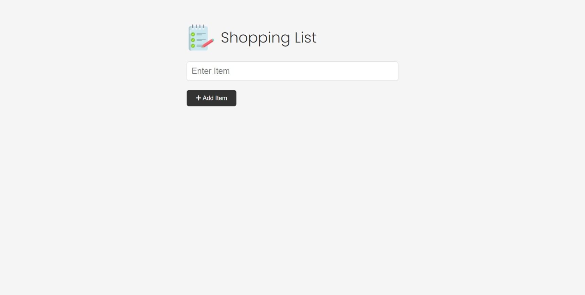
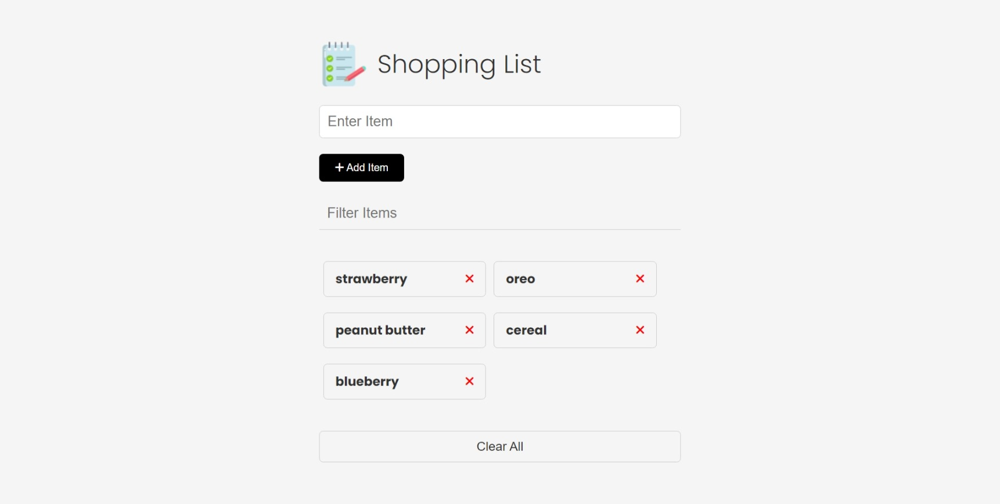
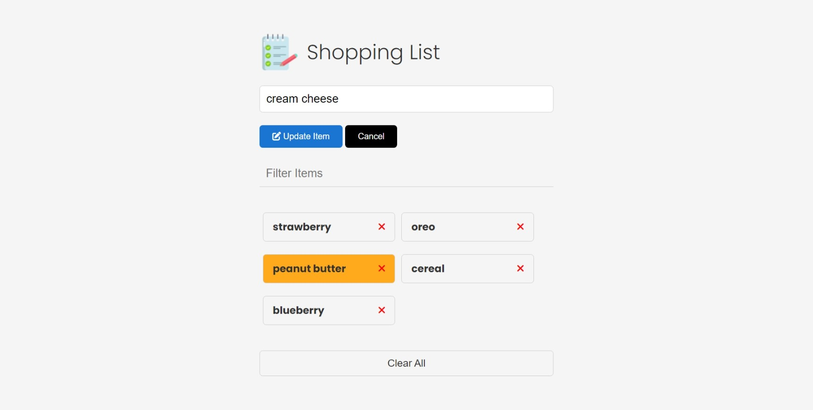
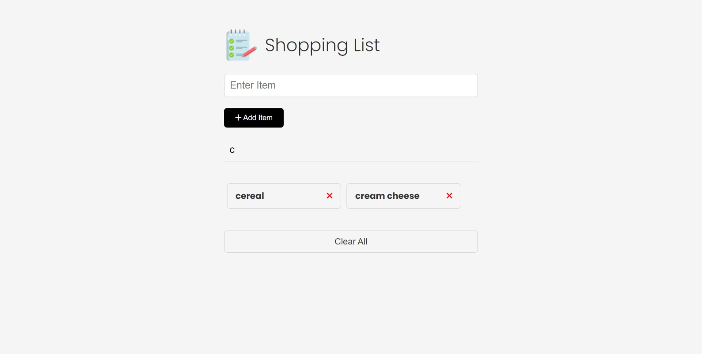
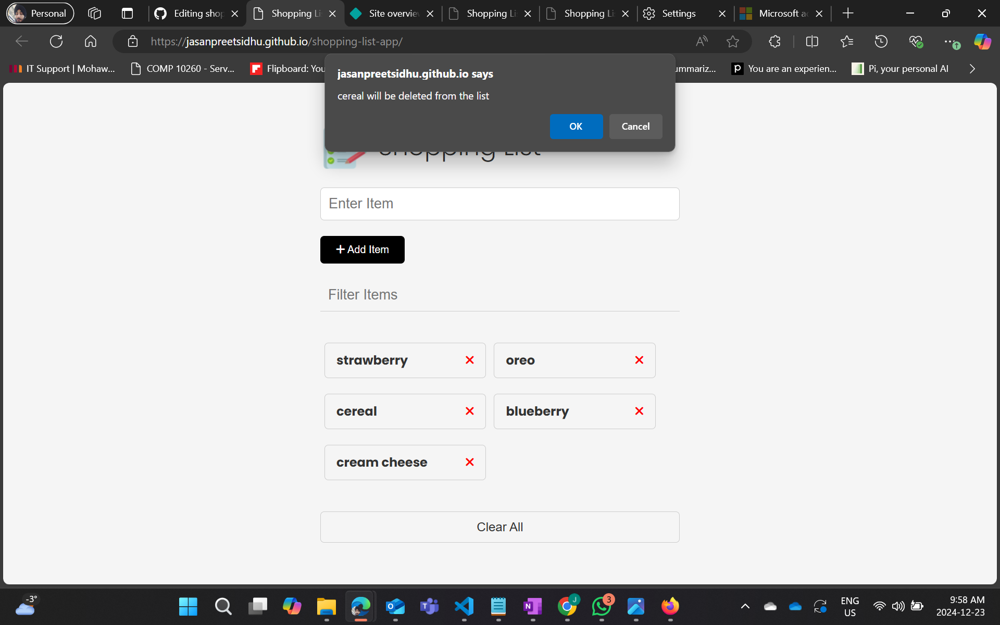

# Shopping List App

A simple [shopping list App](https://jasanpreetsidhu.github.io/shopping-list-app/) that allows you to create and save a list of shopping items. Made dynamically using vanilla JavaScript.

Features:

1. creates a shopping list
2. saves a shopping list on your browser to view it anytime
3. search through items in your shopping list
4. edit existing items in your list
5. remove items from the list anytime
6. intuitive dynamic interface

Technologies used:

- HTML
- CSS
- Javascript
- font-awesome

<table>
  <tr>
    <td>
      <figure>
        <figcaption>App at start</figcaption>
        
      </figure>
    </td>
    <td>
      <figure>
        <figcaption>After adding items</figcaption>
        
      </figure>
    </td>
  </tr>
  <tr>
    <td>
      <figure>
        <figcaption>Updating items</figcaption>
        
      </figure>
    </td>
    <td>
      <figure>
        <figcaption>Filtering items</figcaption>
        
      </figure>
    </td>
  </tr>
  <tr>
    <td>
      <figure>
        <figcaption>Deleting a single item</figcaption>
        
      </figure>
    </td>
    <td>
      <figure>
        <figcaption>Deleting all items</figcaption>
        
      </figure>
    </td>
  </tr>
</table>

